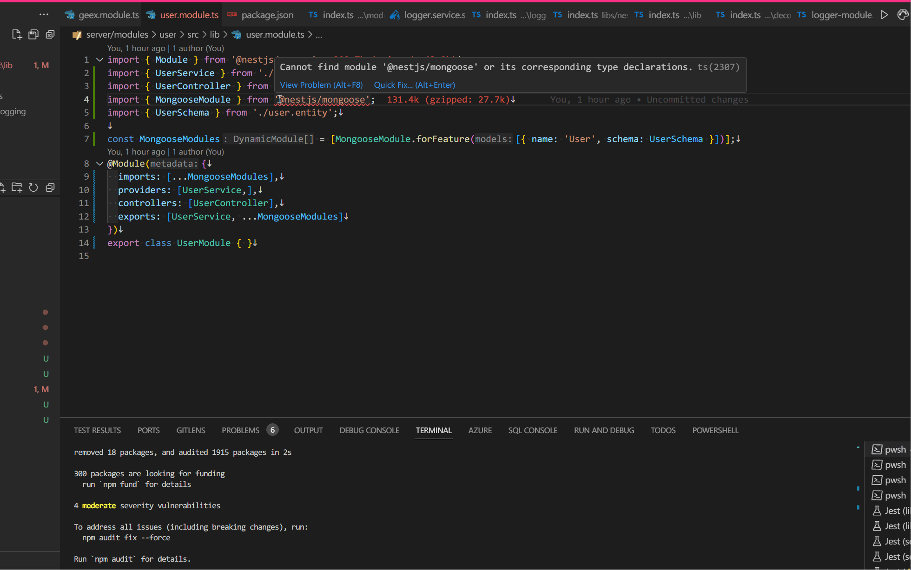

# vscode-here-and-now
Easily install/remove npm package directly from your code or package.json file.



**by select package name here**
```javascript
import foo from 'bar';
const foo2 = require('baz');
```
**Or in package.json**

**then right click or through command**

#
## Key-bindings:
Install package: `shift + alt + i`\
Install package (dev): `shift + alt + d`\
Remove package: `shift + alt + u`
